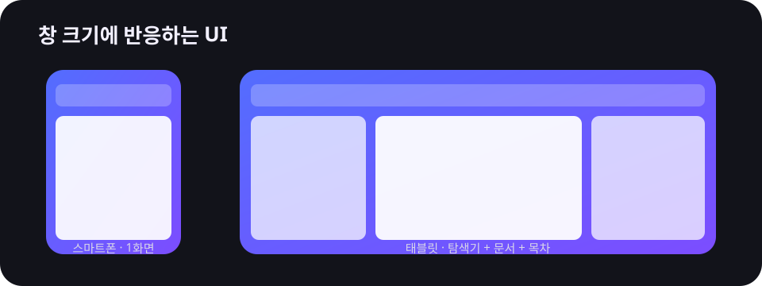
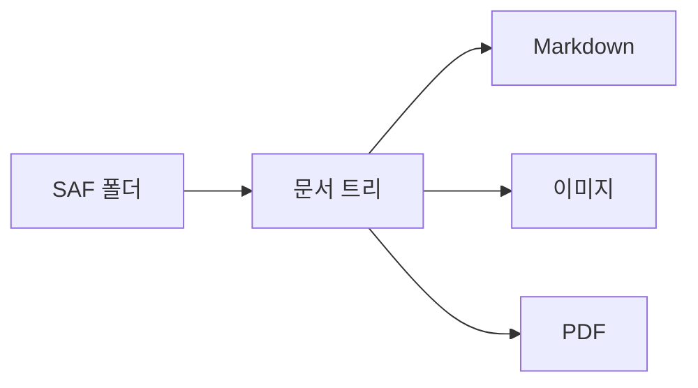

# Markdown Viewer Android 샘플

이 문서는 Android 앱의 Markdown, 로컬 링크, 이미지, 표, 코드 강조와 Mermaid 렌더링을 확인하기 위한 샘플입니다.

## 적응형 레이아웃

스마트폰에서는 탐색기와 문서가 한 화면씩 표시되고, 태블릿에서는 탐색기와 문서를 함께 표시합니다. 충분히 넓은 창에서는 오른쪽에 목차도 나타납니다.

| 창 너비 | 화면 구성 |
| --- | --- |
| 600dp 미만 | 단일 화면 |
| 600–1199dp | 탐색기 + 뷰어 |
| 1200dp 이상 | 탐색기 + 뷰어 + 목차 |



## Mermaid



## 코드 강조

```kotlin
fun layoutFor(widthDp: Int) = when {
  widthDp < 600 -> "compact"
  widthDp < 1200 -> "two-pane"
  else -> "three-pane"
}
```

[상대 경로 링크 테스트](./notes/details.md)
